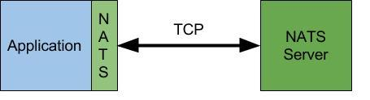
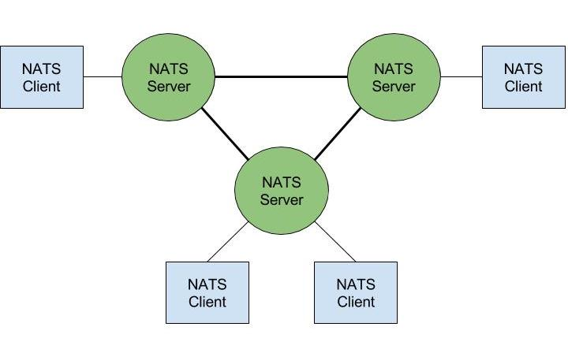
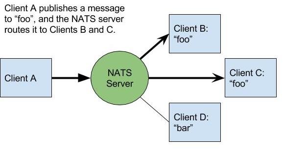
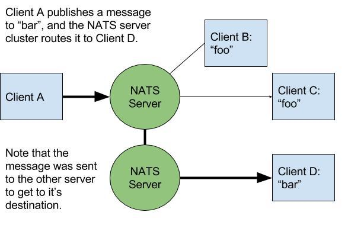
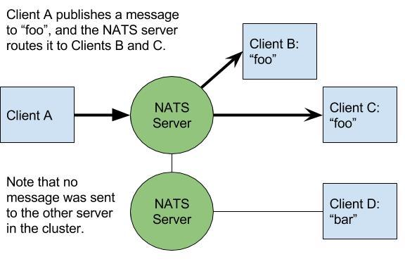
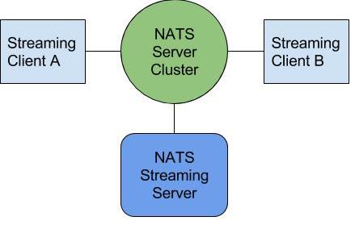
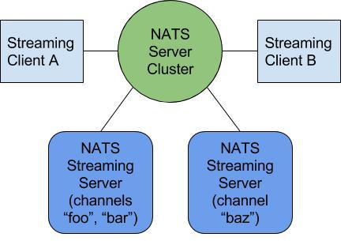

# Understanding NATS Architecture

[NATS](https://nats.io) is a publish/subscribe message oriented middlware an emphasis on simplicity, performance, security, and scalability.  It was built from the ground up to operate in the cloud.

NATS messaging is comprised of core NATS, and NATS streaming.  Core NATS supports at most once delivery, is designed to be lightweight, performant, and always available.  NATS Streaming supports log based persistence providing guaranteed delivery, replay of messages, and subscription continuity (durable subscribers).

# Core NATS

Core NATS is a broker based client-server [messaging](http://nats.io/documentation/concepts/nats-messaging/) software supporting the [publish/subscribe](http://nats.io/documentation/concepts/nats-pub-sub/), [request/reply](http://nats.io/documentation/concepts/nats-req-rep/), and [work queue](http://nats.io/documentation/concepts/nats-queueing/) messaging patterns.

## NATS Server

The NATS server routes messages between NATS clients - applications that use the NATS protocol (usually via a NATS client library) to connect to the the NATS server ([gnatsd](https://github.com/nats-io/gnatsd)).  Logically, applications communicate over a [message bus](http://www.enterpriseintegrationpatterns.com/patterns/messaging/MessageBus.html), but the network configuration is the standard TCP client-server model.

NATS clients send messages to the NATS server over TCP connections that are established by the NATS client libraries.  Published messages are then delivered to clients based on subscriptions made to subjects.  

The NATS server supports [TLS](https://github.com/nats-io/gnatsd#tls) and [Authorization/Authentication](https://github.com/nats-io/gnatsd#securing-nats).

### Clustering

Running a single NATS server introduces a SPOF.  In order to provide high availability and scalability, NATS servers support full mesh clustering (each server is connected to all other servers in the cluster).  There is a one-hop message routing maximum, ensuring messages will never loop througout a cluster.  The servers communicate with each other using a [server-to-server clustering protocol](http://nats.io/documentation/internals/nats-server-protocol/) over a TCP connection.  The protocol supports "discovery" to propogate topology information and changes in real-time with other members of the cluster and clients.  Thus, servers can be dynamially added or removed from a cluster at runtime with zero downtime.  Ideally, a client will have a few addresses of "seed" servers.

It is important to note that from a client perspective, a NATS cluster is considered one entity.  An officially supported NATS client only requires the address of one server in the cluster to connect, but will then receive the complete cluster topology to be able to fail over to other servers in the cluster in the event of a crash or network partition.

More information about clustering can be found [here](https://github.com/nats-io/gnatsd#clustering).

### Subscriptions and routing

When a NATS client creates a subscription, it registers interest for a subject in the server.  Subjects are discussed in the [protocol conventions](http://nats.io/documentation/internals/nats-protocol/).  The server then maps interest in this subject to the particular subscription on the client.  When the server receives a message, it inspects the subject, and routes the message to all subscriptions that have interest in the subject.

When servers are clustered, they automatically register interest to other servers in the cluster *on behalf of their clients*, providing message delivery to clients regardless of which server in the cluster they are connected to.

Notably, messages only get routed to servers in the cluster with client interest, so are not unnecessarily propogated across a network.

## Core NATS client design and architecture

Because the [NATS protocol](http://nats.io/documentation/internals/nats-protocol/) is text based and simple, with only a handful of verbs, NATS Clients are fairly straightforward.  Complexity typically falls into reconnection algorithms and the buffering of messages.  Architecture varies based on the idiomatic features of the client language or platforms, although all officially maintained clients support the following features:
 
  - Allow credentials to be passed when connecting to a server
  - TLS support
  - Publishing of messages
  - Subscribing to subjects and receiving messages
  - Buffering messages for resiliency
  - Reconnection to servers on detecting broken connections
  - Update available servers via the discovery protocol

The typical flow of a NATS client is very straightforward:

  1. Establish a connection to a server and setup error/notification handlers.
  2. Optionally subscribe to subject(s) and setup handlers to process messages.
  3. Optionally publish messages.
  4. When finished, a client will disconnect from the NATS server.

# Streaming server

The [NATS streaming server](https://github.com/nats-io/nats-streaming-server) and streaming clients are a different that core NATS.  Conceptually it's useful to consider NATS Streaming as a layer above NATS - streaming servers are actually core NATS **clients**.  This offers flexibility in allowing NATS streaming servers to have dedicated hosts, distributing work.

When NATS streaming clients connect, they create a *logical* connection over core NATS to a streaming server; one might consider this a session established with the streaming server over core NATS connectivity.  The NATS streaming server is associated with a streaming `cluster-id`, which alongside a unique `client-id` provided by a client is used to setup internal unique subjects for streaming clients to server communication.  Clients then publish and subscribe to the NATS streaming server, receiving acknowledgements that their message has been persisted meeting the at-least-once messaging guarantee.

Because the NATS streaming server requires a core NATS server to operate, the streaming server defaults to using a *side-car* architecture by launching a NATS server instance in its process space.  This is a convenience feature.  While there is a single process, when NATS streaming clients connect, they are actually connecting to the internal NATS server.  This internal NATS server is fully functional and can be configured to join an existing core NATS server cluster.  The NATS streaming server also can run stand-alone, and connect to an external NATS server cluster.  *Running stand-alone is slightly less convenient, but may yield better performance.*

Regardless, from a network (TCP) standpoint the client and NATS streaming server look like this:

## NATS Streaming high availability options

NATS streaming supports two methods to acheive fault tolerance / high availability:

  * The use of lightweight [fault tolerant](https://github.com/nats-io/nats-streaming-server#fault-tolerance) warm standby backups.
  * Full log replication amongst multiple instances using [Hashicorp RAFT](https://github.com/hashicorp/raft).

## Partitioning

Streaming servers can be [partitioned](https://github.com/nats-io/nats-streaming-server#partitioning) to scale.  Multiple streaming servers in the same cluster distribute work based on assigned channnels.

## Streaming client design and architecture

 The [NATS streaming protocol](http://nats.io/documentation/streaming/nats-streaming-protocol/) is more complex, as it requires a larger number of fields in the internal protocol messages.  Because of this, it has been implemented as a binary protocol atop core NATS utlilizing [protobuf](https://github.com/google/protobuf) for serialization. While NATS streaming clients use *a different client API*, because they sit atop NATS, many of the of the features found in core NATS are availableto NATS streaming clients.  However, streaming messages and core NATS messages are not interchangable. 
 
 All officially supported clients provide the following:
 
  - A logical streaming connection with the NATS streaming server over core NATS.
  - Publishing of Messages
  - Subscribing to subjects to receive messages, supporting the various subscription options found [here](https://github.com/nats-io/go-nats-streaming#subscription-start-ie-replay-options), as well as [durable subscription](https://github.com/nats-io/go-nats-streaming#durable-subscriptions) support.
  - Queue group subscriptions.
  - Support for handling publish acknowledgements and acknowedging received messages.

The typical flow of a NATS streaming client is very similar to a core NATS client:

1. Establish a connection to a streaming server
2. Optionally subscribe to subject(s) and setup handlers to process messages.  Messaged are acknowedged.
3. Optionally publish messages, and handle publish acknowedgements from the server.
4. When finished, a client will close its connection with the NATS streaming server.