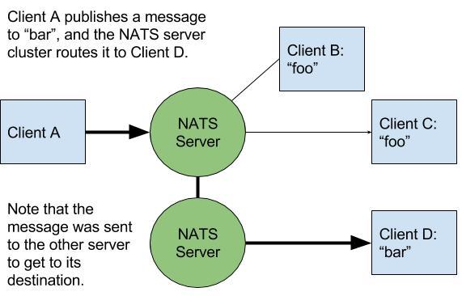

# Understanding NATS Architecture

[NATS](https://nats.io) is a publish/subscribe message oriented middleware with an emphasis on simplicity, performance, security, and scalability.  It was built from the ground up to operate in the cloud.

NATS messaging is comprised of core NATS, and NATS streaming.  Core NATS supports at-most-once delivery, is designed to be lightweight, performant, and always available.  NATS Streaming supports log based persistence providing at-least-once delivery, replay of messages, and subscription continuity (durable subscribers).

# Core NATS

Core NATS is the ideal [messaging](https://docs.nats.io/nats-concepts/subjects.html) software for [publish/subscribe](https://docs.nats.io/nats-concepts/core-nats/pubsub.html), [request/reply](https://docs.nats.io/nats-concepts/core-nats/reqreply.html), and [work queue](https://docs.nats.io/nats-concepts/core-nats/queue.html) messaging patterns.

## NATS Server

The NATS server routes messages between NATS clients - applications that use the NATS protocol (usually via a NATS client library) to connect to the the NATS server ([nats-server](https://github.com/nats-io/nats-server)).  Logically, applications communicate over a [message bus](http://www.enterpriseintegrationpatterns.com/patterns/messaging/MessageBus.html), but the network configuration is the standard TCP client-server model.

NATS clients send messages to the NATS server over TCP connections established by NATS client libraries.  Published messages are delivered to clients based on subscriptions made to subjects.

The NATS server supports [TLS](https://docs.nats.io/running-a-nats-service/configuration/securing_nats/auth_intro/tls_mutual_auth) and [Authorization/Authentication](https://docs.nats.io/running-a-nats-service/configuration/securing_nats/auth_intro/jwt).

### Clustering

Running a single NATS server introduces a SPOF.  In order to provide high availability and scalability, NATS servers support full mesh clustering. Each server is connected to all other servers in the cluster.  There is a one-hop message routing maximum, ensuring messages will never loop througout a cluster.  The servers communicate with each other using a [server-to-server clustering protocol](https://docs.nats.io/reference/reference-protocols/nats-server-protocol) over a TCP connection.  The protocol supports "discovery" to propagate topology information and changes in real-time with other members of the cluster and clients.  Thus, servers can be dynamcially added or removed from a cluster at runtime with zero downtime.  Ideally, a client will have at least 2 addresses of "seed" servers.

It is important to note that from a client perspective, a NATS cluster is considered one entity.  An officially supported NATS client only requires the address of one server in the cluster to connect, but will then receive the complete cluster topology. The client is able to fail over to other servers in the cluster in the event of a crash or network partition.

More information about clustering can be found [here](https://docs.nats.io/running-a-nats-service/configuration/clustering).

### Subscriptions and routing

When a NATS client creates a subscription, it registers interest for a subject in the server.  Subjects are discussed in the [protocol conventions](https://docs.nats.io/reference/reference-protocols/nats-protocol).  The server maps interest in this subject to the particular subscription on the client.  When the server receives a message, it inspects the subject, and routes the message to all subscriptions that have interest in the subject.

When servers are clustered, they automatically register interest to other servers in the cluster *on behalf of their clients*, providing message delivery to clients regardless of which server in the cluster they are connected to.

Notably, messages only get routed to servers in the cluster with client interest, so are not unnecessarily propogated across a network.

## Core NATS client design and architecture

The [NATS protocol](https://docs.nats.io/reference/reference-protocols) is text based and simple, with only a handful of verbs. NATS Clients are fairly straightforward.  Complexity typically falls into reconnection algorithms and the buffering of messages.  Architecture varies based on the idiomatic features of the client language or platforms, although all officially maintained clients support the following features:
 
  - Allow credentials to be passed when connecting to a server
  - TLS support
  - Publishing of messages
  - Subscribing to subjects and receiving messages
  - Buffering messages for resiliency
  - Reconnection to servers on detecting broken connections
  - Update available servers via the discovery protocol

The typical flow of a NATS client is very straightforward:

  1. Establish a connection to a server and setup error/notification handlers.
  2. Optionally subscribe to subject(s) and setup handlers to process messages.
  3. Optionally publish messages.
  4. When finished, a client will disconnect from the NATS server.

# JetStream

[NATS JetStream](https://docs.nats.io/nats-concepts/jetstream) is a horizontally scalable, distributed, and fault-tolerant datastore for NATS.  It is built-in to the NATS server binary, but must be enabled on a per-server basis.  NATS JetStream is designed to be lightweight, performant, and always available.

Conceptually it's useful to consider NATS JetStream as a layer above NATS.  This offers flexibility in allowing NATS JetStream-enabled servers to have dedicated hosts, distributing work.

Note: NATS JetStream is not to be confused with it's now deprecated predecessor [NATS Streaming](https://nats-io.gitbook.io/legacy-nats-docs/nats-streaming-server-aka-stan).

## NATS JetStream high availability options

Within a cluster the high-availability of JetStream is achieved through replication (with an effective minimum of 3 servers replicating the stream's messages) and the use of a Raft consensus protocol.  This means that if a server fails, the stream will continue to be available on the remaining servers in the cluster, and when the failing server is restarted or replaced it will be automatically resynchronized with the other servers in the cluster.

NATS JetStream supports mirroring and sourcing between streams, allowing for data to be replicated between servers and clusters. It also provides for easy placement of the streams on specific clusters and even down to the server level using placement tags (for example to deploy over different availability zones within the same data center or cloud region). Streams can even be moved between servers and clusters at runtime (without any interruption to the stream's availability).

## Scalability

The NATS JetStream-enabled servers distribute the streams amongst themselves, and the clients can connect to any of the servers in the cluster to access the streams.  This means that the clients can be distributed across the cluster, and the streams will be distributed across the JetStream-enabled servers in the cluster.

## JetStream client design and architecture

Clients then just use the JetStream API in the NATS client libraries to access the new features enabled by JetStream.

Underneath the covers, the NATS client libraries use Core NATS to communicate with the JetStream-enabled servers. This means that the clients can connect to any of the servers in the cluster (in any cluster) to access the streams.

A client can use JetStream for:

  - Reliable (acknowledged) publishing of Messages to Streams with optional message deduplication and 'compare and set' concurrency access control.
  - Message replay (with optional server-side message filtering using subject-based addressing), including the ability to replay messages from a specific time or replay messages from a specific sequence number.
  - Distributed message replay and consumption without needing a partitioning scheme. 
  - Exactly-once distributed message consumption (using a stream as a queue).
  - Message acknowledgement and automated message redelivery with extensive functionality.
  - Direct 'get' operations on a stream to retrieve individual messages by sequence number subject name.
  - Key/Value and Object storage.
